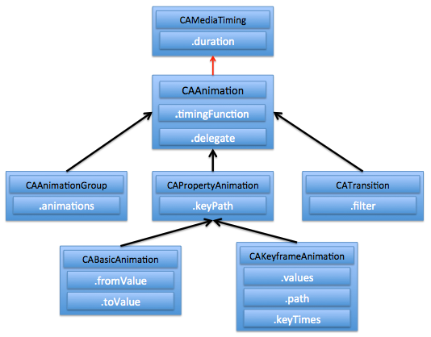
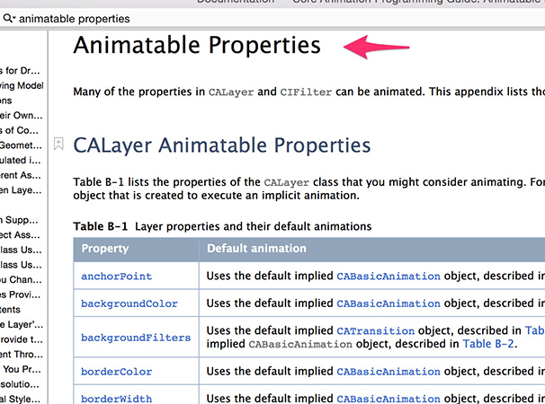

## core animation

`Core Animation`可以用在Mac OS X和iOS平台。两个平台用法稍有区别。

`Core animation`运行在后台线程中，不会阻塞当前UI线程。Core Animation是直接作用在CALayer上的，并非UIView。

### 使用core animation步骤

1. 初始化一个CAAnimation子类对象(CAAnimation不能直接使用)，并配置动画相关数据，如，动画执行时间，是否重复，keyPath等。
2. 通过调用CALayer的addAnimation:forKey:方法增加CAAnimation对象到CALayer中。
3. 通过调用CALayer的removeAnimationForKey:方法可以停止CALayer中的动画。

<strong style="color:green">Swift:</strong>

```swift
@IBOutlet weak var animElem: UIView!;

//---------- 代码分割线 -----------

// 初始化动画子对象，使用属性动画对象
let anim = CABasicAnimation (keyPath: "position");

// 动画执行1秒
anim.duration = 1;

// 动画只执行1次
anim.repeatCount = 1;

// 动画结束值
anim.toValue = NSValue.init(CGPoint:CGPointMake(200, 200));

// 缓动模式
anim.timingFunction = CAMediaTimingFunction.init(name:"easeIn");

// 保持动画后的状态
anim.removedOnCompletion = false;
anim.fillMode = kCAFillModeForwards;

// 添加到layer图层
self.animElem.layer.addAnimation(anim, forKey: nil);
```

<strong style="color:green">Object-C:</strong>

```objc
// 图片控件
@property (weak, nonatomic) IBOutlet UIImageView *imgAnim;

//---------- 代码分割线 -----------

// 初始化动画子对象，使用属性动画对象
CABasicAnimation *anim = [CABasicAnimation animation];

// 动画执行1秒
anim.duration = 1;

// 动画执行1次
anim.repeatCount = 1;

// 使用imgAnim.position 做动画
anim.keyPath = @"position";

// 动画起始值
anim.fromValue = [NSValue valueWithCGPoint:self.imgAnim.center];

// 动画结束值
anim.toValue = [NSValue valueWithCGPoint:CGPointMake(100, 100)];

// 运动后保持状态
anim.removedOnCompletion = NO;
anim.fillMode = kCAFillModeForwards;

// 设置动画缓动模式
anim.timingFunction = [CAMediaTimingFunction functionWithName:@"easeInEaseOut"];

// 绑定当前动画到imgAnim.layer上
[self.imgAnim.layer addAnimation:anim forKey:@"translate"];

```

### CAAnimation 体系:



CAAnimation是所有动画类的父类，但是它不能直接使用，应该使用它的子类，而且上图中，`CAPropertyAnimation`也是不能直接使用，只能使用其子类，`CABasicAnimation`和`CAKeyframeAnimation`。

### 其他

如果具体想知道有哪些属性可以做动画，可以参考苹果官网帮助文档：


