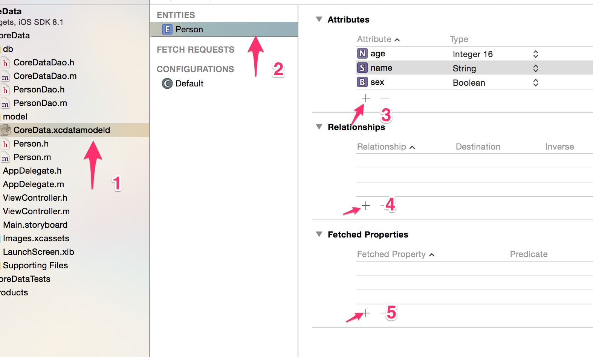
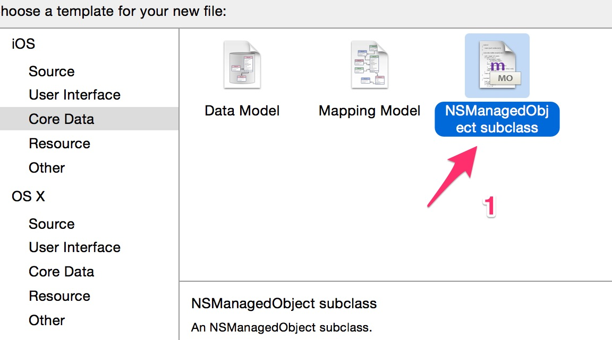

## core data初始化

对于不具有`对象关系模型(ORM)`技术使用经验的人来说，要入门`Core Data`估计会有一定困难，但是我们可以类比`sqlite`的使用方法，对`Corde Data`的使用按部就班，这样获取会容易上手一些：

**数据库项目中的常见操作步骤：**

1. 根据项目需求设计数据库表
2. 打开数据库
3. 对数据库表增、删、改、查

模仿数据库操作基本步骤，我们可以在使用`core data`也使用类似的步骤：

**Core Data 操作步骤**
1. 根据项目需求设计`core data`实体
2. 初始化`core data`配置
3. 使用 `core data` 对 model对象进行增、删、改、查操作

### 1. 根据项目需求设计`core data`实体

`core data`中的实体就像是`sqlite`数据库中的表结构一样，用来描述存储对象的结构属性关系。

**创建实体**

创建一个实体，就像是创建数据库对应的一张表一样，需要设计这个实体的属性、以及实体属性和其他实体属性的关系，实体属性优化查询操作等等，跟设计一张数据库表一样儿一样儿的。



**说明:**

```
1 core data模型文件
2 Person实体
3 添加实体属性
4 添加实体属性关系(多表)
5 设置一些查询索引(类似于数据库查询索引)
```


### 2. 初始化`core data`配置

**2.1 生成实体对象文件**

有了`Person`这个实体，我们首先需要生成相应的实体对象文件：



然后下一步选择`CoreData`，在选择`Person`实体即可。

**2.2 初始化core data操作上下文**

现在有了实体文件，也有了对象模型文件，我们需要初始化`core data`上下文，使用`core data`上下文来操作具体的模型对象，这里的上下文类似于数据库句柄，这里我们参考`XCode`内置的创建`code data`上下文创建的代码：

`CoreDataHelper.h`文件：

```objc
#import <Foundation/Foundation.h>
#import <CoreData/CoreData.h>

@interface CoreDataDao : NSObject

@property (readonly, strong, nonatomic) NSManagedObjectContext *managedObjectContext;
@property (readonly, strong, nonatomic) NSManagedObjectModel *managedObjectModel;
@property (readonly, strong, nonatomic) NSPersistentStoreCoordinator *persistentStoreCoordinator;

- (NSURL *)applicationDocumentsDirectory;


@end
```

`CoreDataHelper.m`文件实现：

```objc
#import "CoreDataDao.h"

@implementation CoreDataDao

@synthesize managedObjectContext = _managedObjectContext;
@synthesize managedObjectModel = _managedObjectModel;
@synthesize persistentStoreCoordinator = _persistentStoreCoordinator;

// core data 存储目录
- (NSURL *)applicationDocumentsDirectory {
    return [[[NSFileManager defaultManager] URLsForDirectory:NSDocumentDirectory inDomains:NSUserDomainMask] lastObject];
}

// 获取context上下文
- (NSManagedObjectContext *)managedObjectContext {
    if (_managedObjectContext != nil) {
        return _managedObjectContext;
    }

    NSPersistentStoreCoordinator *coordinator = [self persistentStoreCoordinator];
    if (!coordinator) {
        return nil;
    }
    _managedObjectContext = [[NSManagedObjectContext alloc] init];
    [_managedObjectContext setPersistentStoreCoordinator:coordinator];
    return _managedObjectContext;
}


// 当前管理model句柄
- (NSManagedObjectModel *)managedObjectModel {
    if (_managedObjectModel != nil) {
        return _managedObjectModel;
    }
    NSURL *modelURL = [[NSBundle mainBundle] URLForResource:@"CoreData" withExtension:@"momd"];
    _managedObjectModel = [[NSManagedObjectModel alloc] initWithContentsOfURL:modelURL];
    return _managedObjectModel;
}

// 建立持久化存储调度
- (NSPersistentStoreCoordinator *)persistentStoreCoordinator {
    if (_persistentStoreCoordinator != nil) {
        return _persistentStoreCoordinator;
    }

    _persistentStoreCoordinator = [[NSPersistentStoreCoordinator alloc] initWithManagedObjectModel:[self managedObjectModel]];
    NSURL *storeURL = [[self applicationDocumentsDirectory] URLByAppendingPathComponent:@"CoreData.sqlite"];
    NSError *error = nil;
    NSString *failureReason = @"There was an error creating or loading the application's saved data.";
    // 使用数据库方式存储实体对象
    if (![_persistentStoreCoordinator addPersistentStoreWithType:NSSQLiteStoreType configuration:nil URL:storeURL options:nil error:&error]) {
        // Report any error we got.
        NSMutableDictionary *dict = [NSMutableDictionary dictionary];
        dict[NSLocalizedDescriptionKey] = @"Failed to initialize the application's saved data";
        dict[NSLocalizedFailureReasonErrorKey] = failureReason;
        dict[NSUnderlyingErrorKey] = error;
        error = [NSError errorWithDomain:@"YOUR_ERROR_DOMAIN" code:9999 userInfo:dict];
        NSLog(@"Unresolved error %@, %@", error, [error userInfo]);
        abort();
    }

    return _persistentStoreCoordinator;
}
@end
```


