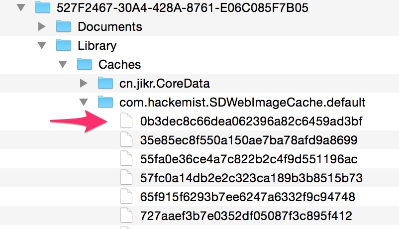

## 使用SDWebImage

不多说，看名字就知道这个库是用来做图片缓存的，包括磁盘缓存和内存缓存。

官方已说明最好的方式使用`cocopod`到自己项目中，有一点需要说明的是，`github`官方实例代码有一些方法已经过时了，如果要查看新的使用方法，最好的方式是去看源代码注释：

使用前需要导入相应的头文件：

```objc
// 此方式使用了cocopod作为第三方库导入
#import <UIImageView+WebCache.h>
```
**函数使用说明：**

```objc
// setImageWithUrl列函数已经deprecated (废弃了)，不再建议使用
cell.imageVew setImageWithURL

// 使用sd_imgeWithUrl*函数代替setImageWithURL
[cell.imageView sd_setImageWithURL: url];
```

磁盘缓存会缓存到当前应用沙盒目录：`Library/Caches/`下, 并且图片名称md5形式存储：



