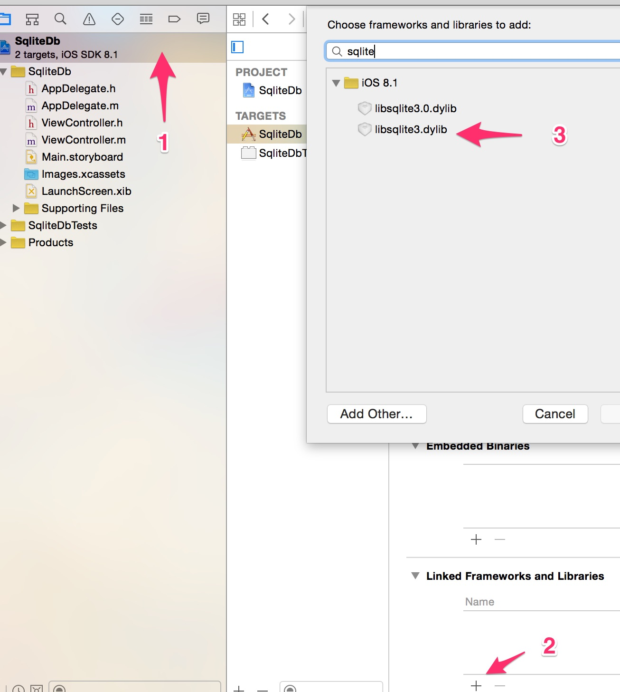

## sqlite常用操作

在使用数据库之前，需要在项目的依赖库中倒入`libsqlite3.dylib`库的依赖，如下：



你会发现会有两sqlite库：`libsqlite3.dylib` 和 `libsqlite3.0.dylib`，那到底选择哪一个呢？区别大致如下，引用别人的一段解释：

>实际上libsqlite3.dylib本身是个链接，它指向libsqlite3.0.dylib。
>也就是说在项目里如果你添加libsqlite3.dylib和添加libsqlite3.0.dylib其实是添加了同一个文件，没有区别，那为什么要添加libsqlite3.dylib呢？
>
>原因在于libsqlite3.dylib总是指向最新的sqlite3动态库，也就是说如果出现了新的动态库（如：libsqlite3.1.dylib）那libsqlite3.dylib将指向这个新的动态库（libsqlite3.1.dylib）而不在是libsqlite3.0.dylib了！所以建议还是要添加libsqlite3.dylib！
``

并且需要在你使用的地方引入`sqlite3.h` 头文件

```objc
#import <sqlite3.h>
```

#### 1. 打开数据库操作

打开数据库使用`sqlite3_open()`函数，如果数据库不存在，则会自动创建：

```objc
sqlite3_open(const char *filename, sqlite3 **ppDb)
```
函数第一个参数要求接受一个C语言字符串数据库路径，第二个为当前数据库操作的指针，可以看出，你不能给它扔一个`OC`的字符串，只能是C语言的字符串，还好`OC`字符串提供一个方法把字符串转为C语言类型

最终代码大致如下：

```objc
sqlite3 *sqliteDb = nil;

// 获取当前App的沙盒目录
NSArray *dbPath = NSSearchPathForDirectoriesInDomains(NSDocumentDirectory, NSUserDomainMask, YES);

// 获取沙盒目录Documents文件夹，因为一个应用中我们明确的知道Document目录只有一个，因此获取索引
NSString *dbDir = [dbPath objectAtIndex:0];

// 拼接数据库名称
NSString *dbAbsolutePath = [dbDir stringByAppendingPathComponent:@"test.db"];

// OC字符串转为C字符串
const char *dbFilePath = [dbAbsolutePath UTF8String];
if(sqlite3_open(dbFilePath, &sqliteDb) != SQLITE_OK){
    // 数据库打开异常，尝试关闭数据库
    sqlite3_close(sqliteDb);
}
```

### 2. 创建数据库表

创建数据表需要使用到另一个C函数`sqlite_exec`:

```c
sqlite3_exec(sqlite3 *, const char *sql, int (*callback)(void *, int, char **, char **), void *, char **errmsg);
```
使用这个函数还是需要提供C语言级别的字符串：

```objc
char *error;

// 创建一个Person表
NSString *tableName = @"Person";

// 拼接要创建的表的数据结构
NSString *sql =[NSString stringWithFormat:@"CREATE TABLE IF NOT EXISTS `%@` (PersonId integer PRIMARY KEY AUTOINCREMENT,Name text)", tableName];

if ([self openDB] == YES) {
    if(sqlite3_exec(self.sqliteDB, [sql UTF8String], NULL, NULL, &error) != SQLITE_OK){
        NSLog(@"创建Person表失败!");
    }else{
        NSLog(@"创建数Person表成功!");
    }
}
```

### 3. 插入操作

插入操作使用的函数同样是`sqlite3_exec()`，没有别的函数：

```objc
NSString *sqlInster =[NSString stringWithFormat:@"insert into `%@` values (2,'李四')",tableName];

sqlite3_exec(_sqliteDB,[sqlInster UTF8String],NULL,NULL,&error);
```

### 4. 更新操作

同插入操作也使用`sqlite3_exec()`操作：

```objc
NSString *sql =[NSString stringWithFormat:@"update `%@` set Name='王五' where PersonId=1",tableName];
sqlite3_exec(_sqliteDB,[sql UTF8String],NULL,NULL,&error)
```

### 5. 删除操作

删除操作也使用`sqlite3_exec()`操作，没啥特别，不再举例

### 6. 预处理语句

用过预处理语句的人应该知道它的好处，同样IOS也提供此功能的`sqlite`函数：

预处理函数有一堆要记住：

```c
sqlite3_prepare_v2()    // 预编译sql语句函数
sqlite3_step()          // 执行查询结果单步操作函数
sqlite3_finalize()      // 释放预处理操作声明
sqlite3_bind_*          // 一堆sqlite3_bind_开头的绑定预处理值变量
```

预处理语句常用的操作步骤是：

    1. 使用sqlite3_open()打开数据库；
    2. 使用sqlite3_prepare_v2()预处理SQL语句；
    3. 使用sqlite3_bind_*相关函数绑定参数；
    4. 使用sqlite3_step()函数执行SQL语句，遍历结果集；
    5. 使用sqlite3_column_text等函数提取字段数据；
    6. 使用sqlite3_finalize和sqlite3_close函数释放资源。

示例代码如下：

```objc
// 打开数据库略
sqlite3_stmt *stmt;

const char *selectSql = "select PersonId,Name from Person where PersonId=?";

int rc = sqlite3_prepare_v2(self.sqliteDB,selectSql,-1,&stmt,NULL);

if(rc == SQLITE_OK){

    // 绑定参数
    sqlite3_bind_int(stmt, 1, 1);

    while (sqlite3_step(stmt) == SQLITE_ROW) { // 循环遍历操作每一行
        char *name = (char *)sqlite3_column_text(stmt, 1); // 查找数据表第一个字段名称

        NSString *OCName = [NSString stringWithUTF8String:name];

        NSLog(@"name is: %@",OCName);

    }

    sqlite3_finalize(stmt); // 释放预编译语句
}

// 关闭数据库
sqlite3_close(db);
```

### 7. 应用升级时数据库升级策略

不像`Android`本身提供了一些内置的升级方法，IOS只能自己对数据库的升级做版本控制，并且`APP`升级是不会覆盖`Documents`目录下的内容，所以升级后`Documents`下的数据库会保持原版本，需要自己手动处理。


