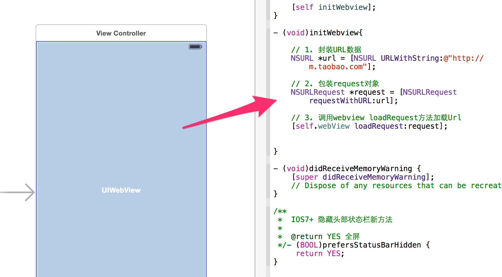

## 基本使用

先来看下 `UIWebView` 简单用法：加载一个Url地址，需要实现下面三个步骤:

1. 封装 `NSURL` 对象，把要加载的url地址塞给 `NSURL`；
2. 封装 `NSURLRequest` 对象；
3. 使用 `UIWebView` 发起请求

代码如下：

```objc
// 1. 封装URL对象
NSURL *url = [NSURL URLWithString:@"http://m.taobao.com"];

// 2. 封装request对象
NSURLRequest *request = [NSURLRequest requestWithURL:url];

// 3. 调用webview loadRequest方法加载Url
[self.webView loadRequest:request];
```
运行效果如下：


当然在这之前有些准备工作，需要使用 `storyboard` 或者代码方式创建一个UIWebView控件，然后才有下文的。


