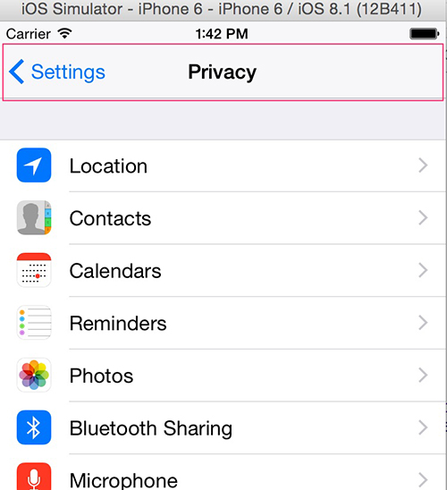

## 导航控制器(UINavigationController)

`UINavigationController`是一种特殊的控制器，在`IOS`中用来管理其他控制器的方式之一，并且此控制器也继承自`UIViewController`控制器。

通过控制器的名字我们可以知道，该控制器是以导航的形式管理过个控制器的。

### 1. 代码方式创建导航控制器

如果掌握了代码创建控制器的方式，那么再使用storyboard来说就变得so easy了。因此最好先掌握使用代码方式构建导航控制器界面，，以便让我们更好的理解导航控制器内部的细节。

#### 1.1 使用导航控制器

因为是以代码的方式构建应用App,因此，在使用`UINavigationController`时需要经历一下几个步骤：

1. 初始化`UINavigationController`
2. 设置`UIWindow`的`rootViewController`为初始化的`UINavigationController`
3. 根据实际情况使用`push`方法向`UINavigationController`添加若干需要管理的自控制器

```objc
// 以下简单使用方式
self.window = [UIWindow alloc] initWithFrame:[[UIScreen mainScreen] bounds];

// 初始化导航控制器
UINavigationController controller = [[UINavigationController alloc] init];

// 添加子控制器到导航控制器中
UIViewController viewA = [[UIViewController alloc] init];
[controller pushViewController:viewA animated:YES];

self.window.rootViewController = nav;

// 显示当前窗口
[self.window makeKeyAndVisible];
```

这里需要注意的是：

1. 添加到导航控制器中的子控制器是以栈的形式存在的
2. 在子控制器访问导航控制器使用`self.navigationController`即可，如果要访问其他子控制器调用`pushViewController`方法

`UINavigationController`有两个成员属性值得注意，这俩属性均是当前导航控制器所有自控制器集合：

```objc
// The current view controller stack.
@property(nonatomic,copy) NSArray *viewControllers;

// An array of children view controllers. This array does not include any presented view controllers.
@property(nonatomic,readonly) NSArray *childViewControllers NS_AVAILABLE_IOS(5_0);

```

#### 1.2 使用pop*方法移除栈顶控制器

既然`UINavigationController`是以栈顶的方式操作自控器，那么要回到之前的界面，只需要移除当前栈顶的`Controller`即可，因此有一些列移除栈方法需要了解：

```objc
//移除当前栈顶控制器，显示上一个控制器
- (UIViewController *)popViewControllerAnimated:(BOOL)animated;

// 回到指定的控制器，返回移除的控制器
- (NSArray *)popToViewController:(UIViewController *)viewController animated:(BOOL)animated;

// 回到栈底控制器
- (NSArray *)popToRootViewControllerAnimated:(BOOL)animated;

```

#### 1.3 其他UINaviController相关方法

```objc
// 除了push方法，addChildViewController也可以子控制器 IOS5.0+ 才支持
- (void)addChildViewController:(UIViewController *)childController NS_AVAILABLE_IOS(5_0);

// 获取位于当前栈顶的控制器
@property(nonatomic,readonly,retain) UIViewController *topViewController;


```

#### 1.4 操作`UINavigationController`的导航条

下图红色区域为导航控制器导航栏部分：




>导航条上界面是由当前栈顶控制器来navigationItem决定

`navigationItem`包含以下内容：

```objc
// 中间标题文字
@property(nonatomic,copy)   NSString        *title;

// 中间部分可以是UIView控件
@property(nonatomic,retain) UIView          *titleView;

// 左边控件
@property(nonatomic,copy) NSArray *leftBarButtonItems NS_AVAILABLE_IOS(5_0);

// 右边控件
@property(nonatomic,copy) NSArray *rightBarButtonItems NS_AVAILABLE_IOS(5_0);
```

##### 1.4.1 设置当前栈顶控制器标题

```objc
self.navigationItem.title = @"导航控制器";

// 添加一个UI控件
self.navigationItem.titleView = [UIButton buttonWithType:UIButtonTypeContactAdd];

// 左边添加返回文字
self.navigationItem.leftBarButtonItem = [[UIBarButtonItem  alloc] initWithTitle:@"返回" style:UIBarButtonItemStyleDone target:self action:@selector(cancel)];
```

##### 1.5 自定义导航栏界面背景

如果需要定制导航栏界面背景，可以用过导航栏控制器的`navigationBar`来实现：

```objc
// 此对象下有调整界面的对象
@property(nonatomic,readonly) UINavigationBar *navigationBar;
```

### 2. storyboard方式创建

使用storyboard来创建导航控制器非常简单，直接在storyboard中拖拖拽拽界面即可，不在赘述。


